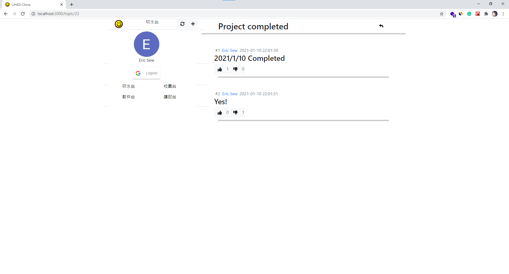
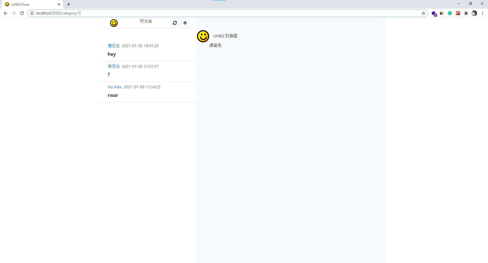

# LIHKG-Clone-Practice

## Introduction

### This is a side project made in Year1 Semester A break for practice
### It takes about 3 weeks in total, in first week I learnt technologies required , in second and third week I work for the project 
### What I gained from this project is the experience of fullstack development on my own

## Functions included
### Render topics and replies fetched from backend api
### Create topic and reply and post to database
### Topics list base on category choice
### Like and dislike function with validation
### Login and logout with google account

## Technologies used 
### Frontend: React.js, React-Router-Dom, React-Google-Login, React-Helmet, Axios, Bootstrap, Fontawesome
### Backend: Spring boot, MongoDB, JSON-simple
### Other tools: Google developer console(for google authentication), Postman(for testing)
